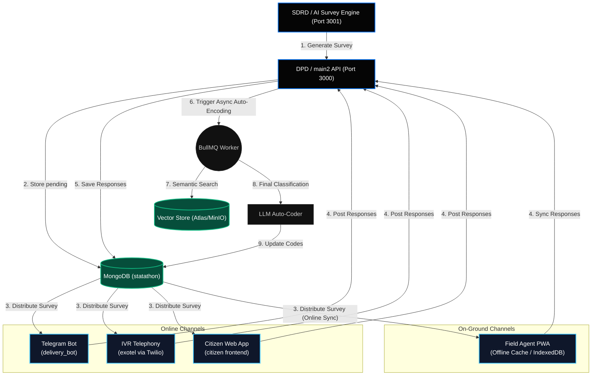
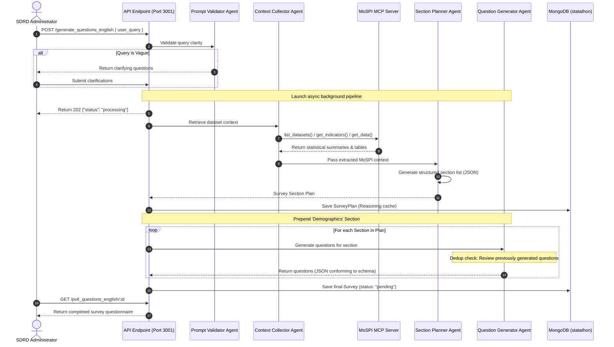
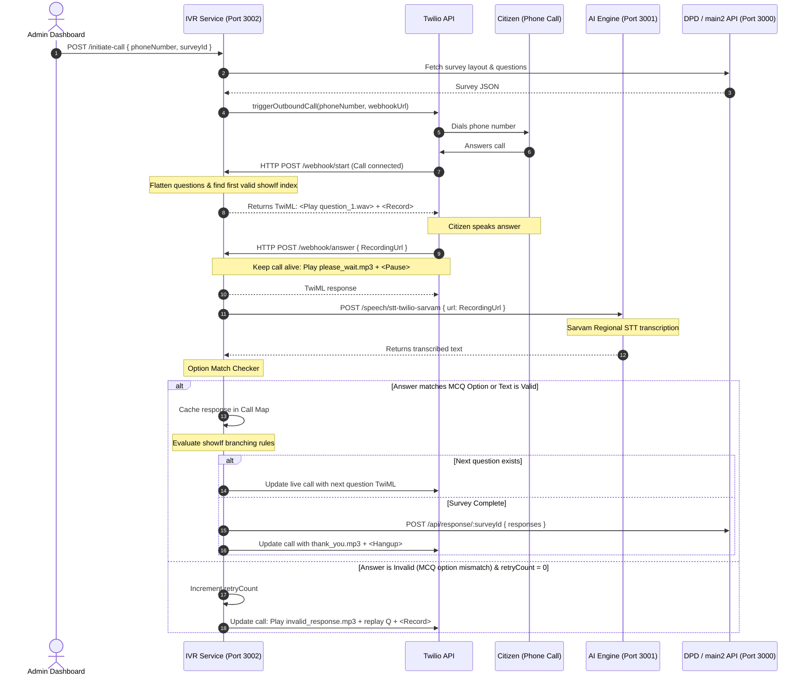
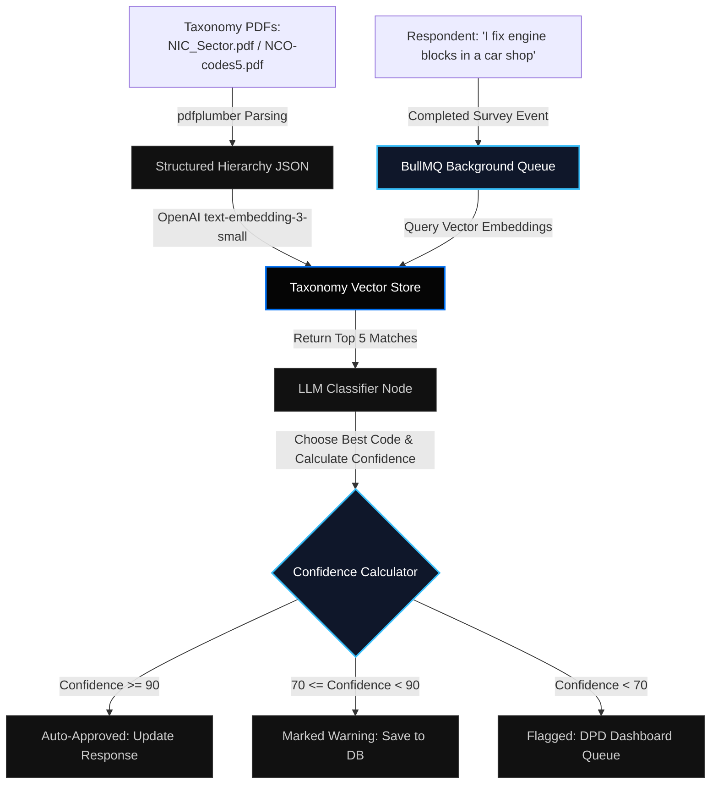
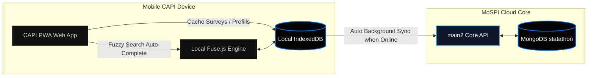

# NARAD — National Automated Response and Data System

> **NARAD** is a state-of-the-art, multi-modal survey platform developed for the **Ministry of Statistics and Programme Implementation (MoSPI)**, Government of India. The platform digitally mirrors the existing National Statistical System (NSS) division model to automate the generation, delivery, ingestion, and validation of socio-economic and enterprise surveys across India.

---

## 🗺️ High-Level Multi-Channel Data Flow

This diagram illustrates how surveys are generated asynchronously by the AI system (grounded in MoSPI datasets) and delivered across online and on-ground channels, with responses being stored centrally and auto-coded.



---

## 📂 Repository Directory Layout

For a detailed technical look at individual components, explore the files linked below:

* **[contexts/](contexts/)** - Architecture plans, design templates, and reference manuals.
  * **[context.md](contexts/context.md)** - Master Project Context & Single Source of Truth.
  * **[adaptive_questioning_plan.md](contexts/adaptive_questioning_plan.md)** - Logic expression specifications and variable injection routing.
  * **[audio_stitching_plan.md](contexts/audio_stitching_plan.md)** - Dynamic IVR audio concatenation guidelines.
  * **[nic_nco_integration_plan.md](contexts/nic_nco_integration_plan.md)** - Auto-coding framework using vector searches and LLMs.
  * **[paradata_implementation_guide.md](contexts/paradata_implementation_guide.md)** - Capturing response micro-timings.
  * **[FOD_Citizen_Implementation_Plan.md](contexts/FOD_Citizen_Implementation_Plan.md)** - Citizen verification, campaigns, and mock database pre-population.
* **[tracing-setup/](tracing-setup/)** - Relational tracing and container log aggregation.
  * **[langfuse-minio/](tracing-setup/langfuse-minio/)** - LLM evaluation telemetry and media storage.
  * **[prometheus-loki-grafana/](tracing-setup/prometheus-loki-grafana/)** - Server metrics dashboards.
* **[backend/](backend/)** - Service backends.
  * **[ai/](backend/ai/)** - SDRD division agent orchestration service.
  * **[main2/](backend/main2/)** - DPD division Core CRUD API.
  * **[exotel/](backend/exotel/)** - FOD division IVR webhook service.
  * **[delivery_bot/](backend/delivery_bot/)** - Telegram bot runner.
* **[frontend/](frontend/)** - User interfaces.
  * **[admin/](frontend/admin/)** - Management control panel dashboard.
  * **[citizen/](frontend/citizen/)** - Respondent questionnaire panel.
  * **[design.md](frontend/design.md)** - Vercel Geist UI component & styling guidelines.

---

## 🤖 1. SDRD: Multi-Agent AI Survey Generation Engine (`backend/ai`)

NARAD automates questionnaire design using a sequential multi-agent team built with **LangChain** and **LangGraph**, tracing prompts through **LangSmith** and **Langfuse**.



### The Subagent Pipeline
1. **Prompt Validator Agent (`prompt_validation_agent`):** Intercepts input. If vague (e.g., *"Generate a survey on jobs"*), it pauses and returns clarifying questions to narrow demographic scope.
2. **Context Collector Agent (`context_collector_agent`):** Connects directly to the **MoSPI Model Context Protocol (MCP)** server. It queries government indicators, geographic parameters, and statistical data.
3. **Section Planner Agent (`section_planner_agent`):** Reviews statistical context and outlines the logical order of survey sections (e.g., Demographics, Income, Expenditure, Employment).
4. **Question Generator Agent (`question_generator_agent`):** Processes sections sequentially. It is passed all previously generated question structures to prevent duplicates.
5. **Section Improver Agent (`improve_section_agent`):** Allows administrators to refine sections via natural language commands (e.g., *"Add questions for higher-education and delete the state selection"*).
6. **Multilingual Translator Agent (`multilang_translator_agent`):** Iteratively translates questions, options, and branching rules into 12 regional languages: `hindi`, `bengali`, `telugu`, `tamil`, `marathi`, `gujarati`, `kannada`, `malayalam`, `odia`, `punjabi`, `urdu`.
7. **Audio Generation Agent:** Translates text to speech using the **Sarvam AI Bulbul** model and uploads files to MinIO.

---

## 📞 2. FOD: Outbound IVR Telephony Delivery (`backend/exotel`)

Outbound telephone surveys are driven via a webhook sequence with **Twilio/Exotel**. Responses are gathered via audio recording, transcribed by AI, evaluated for branching, and submitted to the core database.



### Key Technical Aspects of the IVR Webhook Flow
* **Call Session Caching:** Active calls are stored in-memory (`activeCalls` map) containing demographic targets, response arrays, current question indexes, retries, and timestamps.
* **Keep-Alive Pause:** When Twilio uploads a recording to `/webhook/answer`, transcription takes 2–4 seconds. The service immediately returns a TwiML instruction playing `please_wait.mp3` with a `<Pause>` to prevent the call from hanging up.
* **Fuzzy MCQ Option Matcher:** The transcription is matched against the localized options. If the user says *"Option one"* or *"Rural area"*, the system matches it to the respective option ID. If no match is found, it updates the live call to prompt the user again.
* **Premature Hangup Handler:** The webhook endpoint `/webhook/status` tracks call status. If the citizen hangs up mid-survey, the system submits the partial response to the database so that paradata is preserved.
* **Audio Proxy Header Correction:** Twilio requires strict audio headers. The `/api/survey/proxy-audio` endpoint streams `.wav` files from the AI service's MinIO storage directly to the Twilio line.

---

## 💬 3. FOD: Telegram Delivery Bot (`backend/delivery_bot`)

The Telegram delivery bot (`delivery_bot`) provides conversational survey rendering, supporting step resumes, OTP verification, and branching.

```mermaid
stateDiagram-v2
    [*] --> Start: User types /start
    
    state Start {
        [*] --> CheckActive: Lookup surveyId
        CheckActive --> HasResume: Resume check in MongoDB
        
        state HasResume <<choice>>
        HasResume --> ResumePrompt: in_progress response exists
        HasResume --> SelectLang: No existing response
        
        ResumePrompt --> QuestionLoop: User clicks 'Resume'
        ResumePrompt --> SelectLang: User clicks 'Start Fresh'
    }
    
    state SelectLang {
        [*] --> DisplayLangOptions: English / Hindi
        DisplayLangOptions --> GetName: Callback received
    }
    
    state GetName {
        [*] --> InputName: Awaiting text
        InputName --> GetPhone: Text received
    }
    
    state GetPhone {
        [*] --> InputPhone: Awaiting 10-digit number
        InputPhone --> GetOTP: Validated 10 digits
        InputPhone --> GetPhone: Invalid input
    }
    
    state GetOTP {
        [*] --> SendTelegramOTP: Generate 6-digit code
        SendTelegramOTP --> VerifyOTP: Awaiting user input
        VerifyOTP --> QuestionLoop: Valid OTP code
        VerifyOTP --> GetOTP: Invalid OTP code
    }

    state QuestionLoop {
        [*] --> CheckBranching: Is showIf valid for index?
        CheckBranching --> AskQuestion: Yes
        CheckBranching --> SkipQuestion: No (Increment index)
        SkipQuestion --> CheckBranching
        
        AskQuestion --> SaveAnswer: User clicks inline option
        SaveAnswer --> IncrementIndex: Save answer & update Mongo
        IncrementIndex --> CheckBranching: More questions?
        IncrementIndex --> Submit: No questions left
    }

    Submit --> [*]: Save status: "completed" & purge session
```

---

## ⚡ 4. AI-Driven Adaptive Questioning & Routing

NARAD implements **Bounded AI Adaptive Questioning** to personalize surveys while maintaining strict data schemas.

### Supercharged Logic Engine (`showIf`)
Questions can be skipped or shown using logic that supports compound operations:
```json
"showIf": {
  "$and": [
    { "questionId": "demo_q3", "equals": "urban" },
    { "questionId": "econ_q1", "greaterThan": 15000 }
  ]
}
```
* **Section-Level Skip Rules:** Skip whole sections if they do not match criteria (e.g., if a user is "unemployed", skip the entire "Commute Details" section).
* **Mustache-style Variable Injection:** UI text dynamically updates based on previous responses (e.g., *"Since you work as a **{{demo_occupation}}**, what is your daily commute distance?"*).

---

## 💾 5. DPD: REST API & Ingestion (`backend/main2`)

The `main2` backend acts as the core database controller, managing survey schemas, user invites, campaigns, and responses.

### Key API Endpoints

#### Survey Operations (`/api/survey`)
* `POST /api/survey/` - Create a survey questionnaire.
* `GET /api/survey/` - Fetch all surveys (name, ID, status).
* `GET /api/survey/:survey_id` - Fetch full survey structure.
* `PATCH /api/survey/:survey_id` - Update survey fields (only if status is `pending` or `approved`).
* `DELETE /api/survey/:survey_id` - Remove survey.

#### Ingestion Operations (`/api/response`)
* `POST /api/response/:survey_id` - Save survey response.
  * *Validation:* Standard validation rules check types (`mcq` requires option validation, `checkbox` requires non-empty array checks, `text` requires character checks).
* `GET /api/response/:survey_id` - Fetch all response documents.

#### Auth & User Setup (`/api/auth` & `/api/user`)
* `POST /api/user/invite` - Invite a user.
* `POST /api/auth/setup-password` - Configure password for new users.
* `POST /api/auth/login` - Authenticate user and issue HTTP-only cookies.

#### Outreach Campaigns (`/api/campaign` & `/api/demographic`)
* `POST /api/campaign/upload/:surveyId` - Target a list of citizens using Excel.
* `POST /api/campaign/generate/:surveyId` - Generate campaign targets using demographic filters.
* `GET /api/demographic/lookup` - Look up demographic parameters by LGD code.

---

## 🏷️ 6. Hybrid NIC & NCO Auto-Coding System

NARAD automates the mapping of unstructured text responses to government classification codes: **National Industrial Classification (NIC)** and **National Classification of Occupations (NCO)**.



### Confidence Calculation Details
```text
Total Confidence Score = (Vector Cosine Similarity * 0.40) + (LLM Certainty Score * 0.60)
```
- **Vector Cosine Similarity (40%):** Matches the semantic similarity of the text to the taxonomy code description.
- **LLM Certainty (60%):** The classification confidence score returned by the LLM.
- **Action Thresholds:**
  - `90 - 100` $\rightarrow$ **Auto-Approved**: Saved directly without manual audit.
  - `70 - 89` $\rightarrow$ **Warning Flag**: Saved but flagged for review.
  - `< 70` $\rightarrow$ **Needs Review**: Pushed to the human DPD review queue.

---

## 📴 7. FOD: Offline CAPI PWA Synchronization

For field agents operating in remote regions, the system uses an offline-first workflow.


* **IndexedDB Caching:** The morning sync downloads active surveys and target citizen records (`MockCitizen` schema) to the local device database.
* **Fuzzy Local Search:** Search matches local NIC/NCO codes using `Fuse.js` directly on the device, allowing agents to search offline.
* **Background Sync API:** Syncs responses in the local queue to the server automatically once connection is restored.

---

## 📊 8. Centralized Paradata Analytics

The platform captures question-level micro-timings (`timeTaken` and `timestamp`) to track data collection quality.
```javascript
response: [{
  qid: String,
  optionId: String,
  timeTaken: Number,              // Time spent on question in seconds
  timestamp: { type: Date }       // Date response was recorded
}]
```
* **Speeder Detection:** Automatically flags responses where the question-level duration falls below 1.5 seconds, signaling automated submissions or invalid responses.
* **Friction Analysis:** Tracks sections with high completion times to help administrators identify confusing question layouts.

---

## 🛠️ 9. Environment Variables Reference

Configure these parameters inside your local `.env` files to run the services.

### `backend/ai` `.env`
| Variable | Value / Purpose |
| :--- | :--- |
| `OPENAI_API_KEY` | OpenAI API Key. |
| `CHAT_MODEL` | E.g. `sarvam-30b`, `gemini-1.5-flash`, `gpt-4o`. |
| `CHAT_MODEL_BASEURL` | Routing endpoint (e.g., `https://api.sarvam.ai/v1` or `https://generativelanguage.googleapis.com/...`). |
| `SARVAM_API_KEY` | API Key for Sarvam Speech to Text/TTS conversion. |
| `GROQ_API_KEY` | API Key for Groq Whisper transcription. |
| `TWILIO_ACCOUNT_SID` | SID for Twilio. |
| `TWILIO_AUTH_TOKEN` | Auth Token for Twilio. |
| `MOSPI_MCP_URI` | Endpoint of the MoSPI MCP server. |
| `MONGODB_URI` | Mongo instance address (defaults to `mongodb://localhost:27017`). |
| `REDIS_URL` | Redis server address (defaults to `redis://localhost:6379`). |
| `MINIO_ENDPOINT` | Hostname of the MinIO S3 storage server. |
| `MINIO_ACCESS_KEY` | MinIO Access Key. |
| `MINIO_SECRET_KEY` | MinIO Secret Key. |

### `backend/main2` `.env`
| Variable | Value / Purpose |
| :--- | :--- |
| `MONGODB_URI` | MongoDB Connection URI. |
| `DB_NAME` | Database Name (must be set to `"statathon"`). |
| `PORT` | Local service port (set to `3000`). |
| `CORS_ORIGIN` | Allowed client host origins (e.g., `http://localhost:5173`). |
| `JWT_SECRET` | Token signing secret key. |
| `JWT_REFRESH_SECRET` | Refresh token signing secret key. |

### `backend/exotel` `.env`
| Variable | Value / Purpose |
| :--- | :--- |
| `TWILIO_ACCOUNT_SID` | Twilio Account SID. |
| `TWILIO_AUTH_TOKEN` | Twilio Auth Token. |
| `TWILIO_PHONE_NUMBER` | Telephony Sender Caller ID. |
| `NGROK_URL` | ngrok public tunnel endpoint (e.g. `https://xxxx.ngrok-free.app`). |
| `MAIN2_API_URL` | Backend Endpoint (set to `http://localhost:3000`). |
| `AI_API_URL` | AI Engine Endpoint (set to `http://localhost:3001`). |

---

## 🚀 10. Local Installation & Launch

### Quickstart (Docker Compose Stack)
To build and start the entire survey system in a multi-container network:
```bash
docker compose up --build -d
```

### Manual Installation (Development Mode)
To spin up dependencies locally and run services:

1. **Spin up Redis & MongoDB containers:**
   ```bash
   docker run -d --name redis -p 6379:6379 redis:alpine
   docker run -d --name mongodb -p 27017:27017 mongo:latest
   ```
2. **Install and run the services:**
   * **Start main2 Core API:**
     ```bash
     cd backend/main2 && npm install && npm run dev
     ```
   * **Start AI Survey Engine:**
     ```bash
     cd backend/ai && npm install && npm run dev
     ```
   * **Start IVR Telephony Gateway:**
     ```bash
     cd backend/exotel && npm install && npm run dev
     ```
   * **Start Telegram Bot:**
     ```bash
     cd backend/delivery_bot && npm install && npm start
     ```
   * **Start Admin Interface:**
     ```bash
     cd frontend/admin && npm install && npm run dev
     ```
   * **Start Citizen Interface:**
     ```bash
     cd frontend/citizen && npm install && npm run dev
     ```
