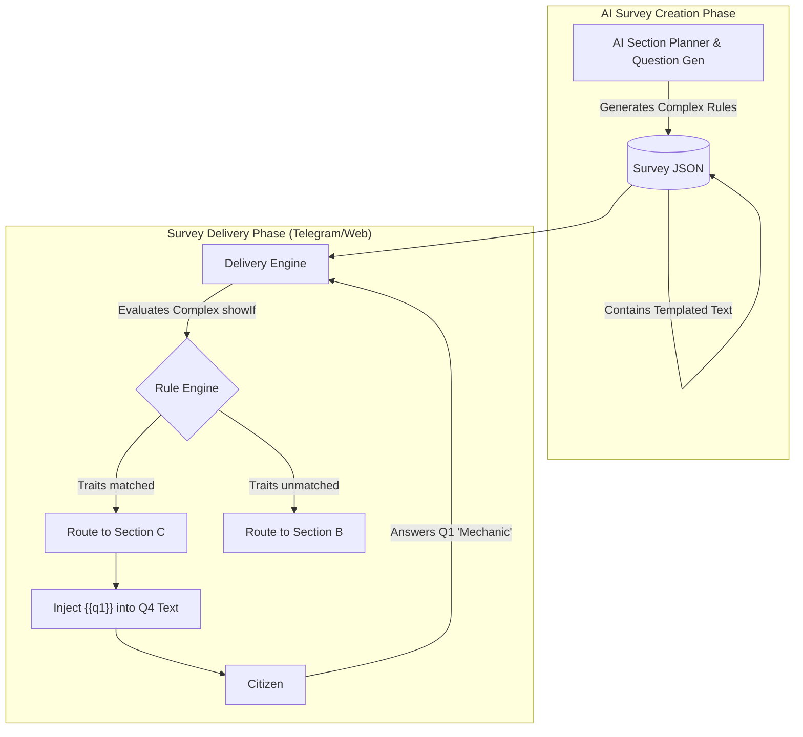

# NARAD — AI-Driven Adaptive Questioning & Routing Master Plan

> [!IMPORTANT]
> This document outlines how NARAD fulfills the hackathon requirement for **"AI-Driven Adaptive Questioning & Dynamic Routing"** without compromising MoSPI's strict data structuring and standardization requirements. 

---

## 1. The Architectural Contradiction (and The Solution)

**The Hackathon Problem Statement asks for:**
* "Automatically infer respondent traits and personalize follow-up questions."
* "Use of lightweight LLMs or rules-based classifiers for dynamic routing."
* "Support for conditional logic, loops, and skip patterns."

**The MoSPI Reality:**
Government surveys cannot have AI agents randomly inventing questions on the fly. If every citizen gets a dynamically invented question, the Data Processing Division (DPD) cannot aggregate the data into tabular reports.

**The Solution: "Bounded AI Adaptive Questioning"**
Instead of the AI generating questions mid-survey, the AI's intelligence is **front-loaded** during the Survey Creation phase (SDRD). The AI builds a massive, highly-branched decision tree with advanced rules-based classifiers. During the survey delivery (FOD), the bot or web app acts as a lightning-fast execution engine that evaluates these complex rules instantly, dynamically injecting variables to personalize the conversation. 

To the citizen, it feels like a highly empathetic, adaptive AI. To MoSPI, it is perfectly structured, deterministic data.

---

## 2. The Three Pillars of Adaptive Questioning

### A. Advanced Rules-Based Routing (Supercharged `showIf`)
We will upgrade the current naive `showIf` (which only supports `equals`) to a robust logical expression engine. This allows the system to route users based on multidimensional inferred traits.
* **Current:** "Show Q2 if Q1 equals Farmer."
* **Upgraded:** "Show Q2 if (Q1 equals Farmer OR Q1 equals Labourer) AND (Income is less than 5000)."

### B. Block-Level (Section) Skip Logic
Currently, logic is tied to individual questions. We will allow AI to attach rules to entire **Question Sections**. If a respondent answers "Unemployed", the system dynamically drops the entire "Commute Details" and "Tax Details" blocks, skipping them directly to the "Assistance Programs" block.

### C. Dynamic Variable Injection (Templating)
To satisfy the "personalize follow-up questions" requirement, the AI builder will generate text with Mustache-style variables representing past answers.
* **Static Question:** "What is your main challenge at work?"
* **Adaptive Question:** "Since you work as a **{{q_occupation}}**, what is the main challenge you face there?"
The delivery bot replaces the variable in real-time, building instant rapport.

---

## 3. System Flowcharts

### AI Survey Generation vs Delivery Execution


---

## 4. Schema Enhancements Required

### A. Question Schema (`surveySchema.js`)
We must overhaul the `showIf` schema to support nested logical operators (`$and`, `$or`) and comparators (`$eq`, `$gt`, `$lt`).

```javascript
// NEW showIf Schema definition
const ShowIfSchema = new mongoose.Schema({
    // Support MongoDB-style query operators for frontend evaluation
    $and: { type: [mongoose.Schema.Types.Mixed], required: false },
    $or: { type: [mongoose.Schema.Types.Mixed], required: false },
    // Simple fallback for backward compatibility
    questionId: { type: String, required: false },
    equals: { type: mongoose.Schema.Types.Mixed, required: false },
    greaterThan: { type: Number, required: false },
    lessThan: { type: Number, required: false }
}, { _id: false, strict: false });
```

### B. Section Schema Update
Attach `showIf` to the `questionSectionSchema` to allow block-level routing.

```javascript
const questionSectionSchema = new mongoose.Schema({
    sectionName: { type: String, required: true },
    showIf: { type: ShowIfSchema, required: false }, // NEW: Block-level routing
    questions: { type: [QuestionSchema], required: true }
}, { _id: false });
```

---

## 5. AI Prompt Enhancements (`question_generation` agents)

To make the AI actually use these new features, the system prompts for the **Question Generator Agent** and **Section Planner Agent** must be explicitly upgraded.

### Prompt Additions:
1. **Enforce Adaptive Routing:** 
   > *"You must create adaptive survey flows using the `showIf` logic. Use complex `$and` or `$or` conditions where appropriate to infer traits based on a combination of previous answers. Attach `showIf` to entire sections if a whole block of questioning is irrelevant based on demographics."*
2. **Enforce Personalized Templating:**
   > *"To personalize the survey, you must inject previous answers into subsequent questions using the `{{qid}}` syntax. For example, if q1 asks for their occupation, q2 should be phrased as: 'How many years have you worked as a {{q1}}?'"*

---

## 6. Frontend / Bot Execution Logic

The delivery channels (Telegram Bot in `delivery_bot` and Web Citizen Panel) need a simple Rule Evaluator function.

```javascript
// Example Rules-Based Evaluator for the Delivery Bot
function evaluateShowIf(showIf, userAnswers) {
    if (!showIf) return true; // Show by default

    // Handle complex $and logic
    if (showIf.$and) {
        return showIf.$and.every(condition => evaluateShowIf(condition, userAnswers));
    }
    
    // Handle standard > < ==
    const answer = userAnswers[showIf.questionId];
    if (showIf.equals && answer !== showIf.equals) return false;
    if (showIf.greaterThan && Number(answer) <= showIf.greaterThan) return false;
    if (showIf.lessThan && Number(answer) >= showIf.lessThan) return false;

    return true;
}

// Variable Injection
function personalizeText(textTemplate, userAnswers) {
    return textTemplate.replace(/\{\{(.*?)\}\}/g, (match, qid) => {
        return userAnswers[qid] || ""; // Replace {{q1}} with actual answer
    });
}
```

---

## 7. How This Wins the Hackathon

| Hackathon Requirement | How This Solves It | Why it's Better than Pure LLM |
|---|---|---|
| **"Rules-based classifiers for dynamic routing"** | The upgraded `showIf` schema acts as a lightning-fast rule engine evaluating traits. | Zero latency. Evaluates instantly on the client/bot. |
| **"Automatically infer respondent traits"** | Complex logic (`$and` / `$or`) infers multidimensional traits (e.g. low-income + farmer). | 100% deterministic. Never hallucinates the wrong trait. |
| **"Personalize follow-up questions"** | The `{{qid}}` variable injection adapts question text mid-survey. | DPD gets standard tabular data because the core `qid` never mutates, only the UI text changes. |

### Next Steps for Implementation
1. **Schema Update:** Push the `ShowIfSchema` upgrades to `ai` and `main2` schemas.
2. **AI Prompts:** Inject the new rules into `backend/ai/src/prompts/question_generation/index.js`.
3. **Delivery Bot:** Write the `evaluateShowIf` and `personalizeText` parser in `backend/delivery_bot`.
