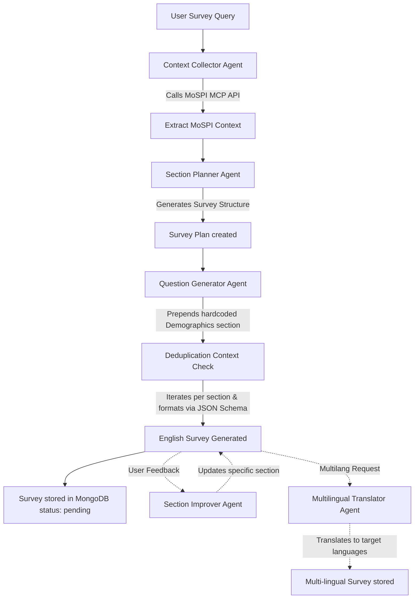

# Statathon-Narad AI Backend Orchestration System

Welcome to the **Statathon-Narad AI Backend**. This service is a state-of-the-art, multi-agent orchestrator designed to generate highly contextual, multi-lingual field surveys backed by real government data from the **Ministry of Statistics and Programme Implementation (MoSPI)** of India. 

The backend utilizes **LangChain**, **LangGraph**, and **Model Context Protocol (MCP)** to dynamically fetch relevant statistical datasets, plan logical survey structures, generate domain-specific questions, support speech-to-text (STT)/text-to-speech (TTS) interfaces, and translate questionnaires into major regional Indian languages.

---

## 🗺️ High-Level Agentic Workflow

The survey generation process flows through a sequential multi-agent pipeline:



---

## 📂 Directory & File Structure

```directory
backend/ai/
├── app.js                          # Express app configuration & global route registering
├── index.js                        # Service entry point; initializes MongoDB and starts server
├── package.json                    # Dependencies (LangChain, LangGraph, Mongoose, Sarvam AI, Groq, Express)
├── postman.json                    # Postman collection for manual API testing
├── readme.md                       # Comprehensive system documentation (this file)
└── src/
    ├── constants.js                # Shared constants (e.g., MongoDB database name)
    ├── models/
    │   ├── agents.js               # Multi-agent initializations and logic (LangChain createAgent)
    │   └── llms.js                 # LLM configuration (ChatOpenAI, Groq STT, Sarvam AI clients)
    ├── mongodb/
    │   ├── connect.js              # Mongoose MongoDB connection establishment & hooks
    │   ├── surveyPlan.js           # Schema for saving the intermediate context & section plans
    │   └── surveySchema.js         # Final structural schema for the multi-lingual surveys
    ├── prompts/
    │   └── question_generation/
    │       └── index.js            # Comprehensive Master System Prompts for all 5 Agents
    ├── router/
    │   ├── question_generation_route.js # Router for Survey Creation, Polling, Editing, and Translations
    │   └── speech_conversion.js    # Router for Twilio-integrated STT/TTS operations
    ├── schema/
    │   └── questionSchema.js       # JSON schemas constraining LLM output formats to match Mongoose schemas
    ├── tools/
    │   ├── index.js                # Tool exports stub
    │   ├── multi_mcp_client.js     # LangChain MCP Adapter connecting to the MoSPI MCP server
    │   └── searchtool.js           # Tavily search tool (alternative context backup)
    └── utils/
        ├── generate_questions.js   # Background worker orchestrating full survey initialization
        ├── improve_section.js      # Utility executing section refinement via the Improver Agent
        ├── stt.js                  # Speech-to-Text utilities supporting Whisper (Groq) & Sarvam AI
        ├── translate_survey.js     # Utility orchestrating section-by-section multi-lingual translations
        └── tts.js                  # Text-to-Speech utility utilizing Sarvam AI Bulbul model
```

---

## ⚡ API Endpoints Reference

The backend exposes **6 main survey routes** (grouped under `/question-generation`) and **2 speech conversion routes** (grouped under `/speech`).

### 1. Survey Generation & Modification (`/question-generation`)

#### 🟢 GET `/` (Health Check)
* **Description:** Verifies if the question generation routes are active.
* **Response:**
  ```json
  "Question Generation Route Active"
  ```

#### 🔵 POST `/generate_questions_english` (Initialize Generation)
* **Description:** Initializes an asynchronous, background pipeline to query MoSPI, draft a structural plan, and generate questionnaire sections in English.
* **Payload:**
  ```json
  {
    "user_query": "unemployment rate in rural and urban areas",
    "improved_answers": "Focus strictly on youth aged 18-25" // Optional clarification
  }
  ```
* **Under-the-Hood Logic:**
  1. Combines `user_query` and `improved_answers` (if provided) into a `final_query` for better context.
  2. Generates a unique `surveyId` (UUIDv4).
  3. Creates a placeholder document in MongoDB with state `pending`.
  4. Launches `generate_english_questions_retry` in the background (fire-and-forget).
     - *Note: A standard "Demographics" section is prepended to every survey before AI generation begins.*
     - *The AI is fed the list of already generated questions to avoid duplicating demographic questions.*
  5. Returns immediately to prevent client timeouts during complex agent iterations.
* **Response:**
  ```json
  {
    "surveyId": "1a2b3c4d-5e6f-7g8h-9i0j-1k2l3m4n5o6p",
    "status": "processing"
  }
  ```

#### 🟢 GET `/poll_questions_english/:surveyId` (Fetch Progress)
* **Description:** Polls the database for the status of the English survey generation. Clients should fetch this every **5 to 10 seconds** until completed.
* **Path Params:** `surveyId` (UUID)
* **Response (Still Processing):**
  ```json
  {
    "status": "processing"
  }
  ```
* **Response (Completed):**
  ```json
  {
    "status": "completed",
    "data": {
      "_id": "...",
      "surveyId": "1a2b3c4d-...",
      "name": "Survey on unemployment rate in rural and urban areas",
      "status": "complete",
      "supportedLanguages": ["english"],
      "questionSections": [
        {
          "sectionName": "Demographics",
          "questions": [
            {
              "qid": "demo_q1",
              "type": "mcq",
              "text": { "english": "What is your main place of residence?" },
              "options": [
                { "id": "opt1", "label": { "english": "Rural Area" } },
                { "id": "opt2", "label": { "english": "Urban Area" } }
              ],
              "audio": { "english": "" }
            }
          ]
        }
      ],
      "categories": ["AI Generated"],
      "createdBy": "AI-Agent"
    }
  }
  ```

#### 🔵 POST `/improve_section_english` (Section Refinement)
* **Description:** Allows administrators or survey designers to refine a single section based on custom, natural-language instructions (e.g., adding or removing specific questions).
* **Payload:**
  ```json
  {
    "surveyId": "1a2b3c4d-...",
    "sectionName": "Demographics",
    "instructions": "Add one more question about education level and remove the state question."
  }
  ```
* **Under-the-Hood Logic:**
  1. Finds the existing survey plan (`SurveyPlan` collection) to read the MoSPI context and original description of the section.
  2. Pulls the existing questions in the section from `Survey`.
  3. Temporarily sets the survey status to `updating`.
  4. Invokes the `improve_section_agent` synchronously to generate revised questions complying with the instructions.
  5. Overwrites the section in the database and resets status to `complete`.
* **Response:**
  ```json
  {
    "surveyId": "1a2b3c4d-...",
    "sectionName": "Demographics",
    "status": "completed"
  }
  ```

#### 🔵 POST `/generate_questions_multilang` (Multi-Language Translation)
* **Description:** Translates the generated English survey questions into a set of target regional Indian languages.
* **Payload:**
  ```json
  {
    "surveyId": "1a2b3c4d-...",
    "languages": ["hindi", "marathi"]
  }
  ```
* **Under-the-Hood Logic:**
  1. Verifies the survey exists.
  2. Sets status to `translating`.
  3. Offloads the translation task to `translate_survey` asynchronously.
  4. The translation worker processes section-by-section, calling `multilang_translator_agent` with up to 3 retries.
  5. Merges new translations into the question structure and appends to `supportedLanguages`.
* **Response:**
  ```json
  {
    "surveyId": "1a2b3c4d-...",
    "status": "processing"
  }
  ```

#### 🟢 GET `/poll_questions_multilang/:surveyId` (Poll Translation Progress)
* **Description:** Polls progress for multi-lingual translation tasks.
* **Response (Still Translating):**
  ```json
  {
    "status": "processing"
  }
  ```
* **Response (Completed):**
  ```json
  {
    "status": "completed",
    "data": {
      "surveyId": "1a2b3c4d-...",
      "status": "pending",
      "supportedLanguages": ["english", "hindi", "marathi"],
      "questionSections": [
        {
          "sectionName": "Demographics",
          "questions": [
            {
              "qid": "demo_q1",
              "type": "mcq",
              "text": { 
                "english": "What is your main place of residence?",
                "hindi": "आपका मुख्य निवास स्थान क्या है?",
                "marathi": "तुमचे मुख्य राहण्याचे ठिकाण काय आहे?"
              },
              "options": [
                { 
                  "id": "opt1", 
                  "label": { 
                    "english": "Rural Area",
                    "hindi": "ग्रामीण क्षेत्र",
                    "marathi": "ग्रामीण भाग"
                  } 
                }
              ],
              "audio": { "english": "", "hindi": "", "marathi": "" }
            }
          ]
        }
      ]
    }
  }
  ```

---

### 2. Speech Conversion (`/speech`)

#### 🟢 GET `/` (Health Check)
* **Response:** `"Speech Generation Route Active"`

#### 🔵 POST `/stt-twilio` (Whisper Transcription)
* **Description:** Download audio recordings generated via Twilio's webhook system and transcribes them using Groq-powered Whisper.
* **Payload:**
  ```json
  {
    "url": "https://api.twilio.com/.../Recordings/RE123456789"
  }
  ```
* **Response:**
  ```json
  "Hello, I am calling from the rural district to report unemployment levels."
  ```

#### 🔵 POST `/stt-twilio-sarvam` (Sarvam AI Transcription)
* **Description:** Transcribes Indian-accented or mixed-language audio recordings from Twilio using Sarvam AI's specialized regional speech models (`saaras:v3`).
* **Payload:**
  ```json
  {
    "url": "https://api.twilio.com/.../Recordings/RE123456789"
  }
  ```
* **Response:**
  ```json
  "मी ग्रामीण भागात राहत असून सध्या बेरोजगार आहे."
  ```

---

## 🤖 The Connection Prompts (Master AI Instructions)

All system prompts are loaded from `src/prompts/question_generation/index.js` and serve as the programmatic nervous system of the agents.

### 1. Context Collector System Prompt
Constrains the agent to a rigorous 4-step execution flow to extract MoSPI context without guessing metadata attributes:

> [!IMPORTANT]
> **Strict 4-Step Pipeline Rules:**
> 1. **`list_datasets()`** - Fetches all active MoSPI datasets (e.g., PLFS for labour force, ASI for industries, CPI for inflation).
> 2. **`get_indicators(dataset)`** - Retrieves indicators and codes (like `frequency_code` or `indicator_code`).
> 3. **`get_metadata(dataset, ...)`** - Extracts precise valid codes for states, sectors, or years. **No guessing is allowed.**
> 4. **`get_data(dataset, filters)`** - Queries the specific numerical and statistical facts using strict filters with a standard `limit: 50` parameter.

### 2. Section Planner System Prompt
Instructs the planner to establish a logically sequenced layout of the survey. It is strictly constrained to output **only raw JSON** matching the `SectionPlanSchema`.
```text
You are a strict JSON outputting agent. Your task is to plan the logical sections of a survey based on the user's input and context.
You MUST output ONLY a valid JSON array. DO NOT use markdown, do NOT use backticks, do NOT add explanations.
Format Example:
[
  {
    "sectionName": "Demographics",
    "description": "Questions about age, gender, and location.",
    "questionCount": 3
  }
]
Output ONLY the JSON array starting with [ and ending with ].
```

### 3. Question Generator Prompts (English & Multi-lang)
Directs the generation of individual questions tailored specifically to a section description and backed by the collected MoSPI data. The output is bounded by deep schema structures matching `questionSchema.js`.

### 4. Section Improver Prompt
Instructs the AI to act as a precise questionnaire editor. It reads instructions like *"remove the state question"* or *"add one about income range"*, examines existing questions, applies the delta changes, and outputs a complete updated JSON array.

### 5. Multilingual Translator Prompt
Orchestrates deep translation into regional target languages while strictly maintaining original English properties inside the localized Maps.
* **Supported Languages:** `hindi`, `bengali`, `telugu`, `tamil`, `marathi`, `gujarati`, `kannada`, `malayalam`, `odia`, `punjabi`, `urdu`.

---

## 💾 MongoDB Database Schemas

The database layer utilizes two primary collections: `SurveyPlan` (for caching model reasoning context) and `Survey` (the primary questionnaire repository).

### 📋 Survey Schema (`Survey`)
```javascript
const QuestionSchema = new mongoose.Schema({
  qid: { type: String, required: true },
  type: { type: String, enum: ["mcq", "text", "checkbox"], required: true },
  text: { type: Map, of: String, required: true },             // e.g. { "english": "...", "hindi": "..." }
  audio: { type: Map, of: String, required: true },            // e.g. { "english": "URL", "hindi": "URL" }
  options: {
    type: [OptionSchema],                                      // List of choices containing localized labels
    required: function () { return this.type === "mcq" || this.type === "checkbox"; }
  },
  prefill: { type: String, required: false },
  showIf: {                                                    // Branching logic config
    questionId: { type: String, required: true },
    equals: { type: String, required: true }
  }
});
```

### 📋 Survey Plan Schema (`SurveyPlan`)
Stores the reasoning path and structural plans, linking them back to the active survey:
```javascript
const SurveyPlanSchema = new mongoose.Schema({
  surveyId: { type: String, required: true },
  mcp_context: { type: String, required: true },               // Raw MoSPI data collected
  sectionPlan: [{
    sectionName: { type: String, required: true },
    description: { type: String, required: true },
    questionCount: { type: Number, required: true }
  }]
});
```

---

## 🛠️ Environmental Settings (`.env`)

The `.env` configuration determines which model providers and client credentials are bound to the LangChain orchestrator.

| Variable Name | Typical Value / Purpose |
| :--- | :--- |
| `OPENAI_API_KEY` | Subscription Key for the chat model provider |
| `CHAT_MODEL` | E.g. `sarvam-30b`, `gemini-1.5-flash`, `gpt-4o` |
| `CHAT_MODEL_BASEURL` | Routing endpoint (e.g. `https://api.sarvam.ai/v1` or `https://generativelanguage.googleapis.com/...`) |
| `GOOGLE_API_KEY` | Direct Gemini key if needed |
| `SARVAM_API_KEY` | Subscribed key for Sarvam Speech to Text/TTS conversion APIs |
| `GROQ_API_KEY` | Groq api key for running Whisper transcription at high speed |
| `TWILIO_ACCOUNT_SID` | SID for fetching phone recording files |
| `TWILIO_AUTH_TOKEN` | Auth Token for phone recording authorization headers |
| `MOSPI_MCP_URI` | Address of the MoSPI MCP server (`https://mcp.mospi.gov.in`) |
| `MONGODB_URI` | Mongo instance address (defaults to `mongodb://localhost:27017`) |
| `REDIS_URL` | Redis server address (defaults to `redis://localhost:6379`) |

---

## 🚀 Local Prerequisites & Startup

Before launching the server, ensure your local database and cache layers are ready.

### 1. Spin up Redis Cache
```bash
docker run -d --name redis -p 6379:6379 redis:alpine
```

### 2. Configure Environment
Clone `.env.dummy` to `.env` and fill in active keys:
```bash
cp .env.dummy .env
```

### 3. Install & Start Backend Server
```bash
npm install
npm start
```
The server will connect to MongoDB, hook standard events, and begin listening on the designated `PORT` (default `3001`).

---

## 🏗️ Recent Architectural Updates (June 2026)

- **Translation Pipeline Stabilization:** Synchronized the `backend/ai` survey schema with `backend/main2` by removing strict `minlength: 1` and `required: true` constraints on the `audio` map. This resolves critical database validation failures that were silently blocking status transitions (`translating` -> `pending`), fixing infinite loading issues during multi-language translation.
- **Database Synchronization:** The `backend/ai` database connection (`src/constants.js`) was updated to point to the unified `"statathon"` database instead of `"narad_ai"`. This ensures that both the main API and the AI microservice read from and write to the exact same MongoDB collections.
- **Port Re-assignment:** The AI backend is now strictly bound to port `3001` to resolve proxy conflicts with `backend/main2` (which runs on `3000`).
- **Prompt Validation Integration:** Fixed an issue where the `prompt_validation_agent` was not correctly imported into the question generation route. The AI now actively intercepts vague user prompts and successfully returns clarifying follow-up questions before initiating the MoSPI query sequence.
- **Agentic Logging & Real-time Streaming:** Implemented a lightweight, memory-safe in-memory `surveyLogs` store using ES6 `Map` in the AI backend. This enables LangGraph subagents to emit lifecycle events (Started/Completed) which are streamed to the frontend terminal UI for complete user transparency without exposing raw AI JSON reasoning.
- **LangGraph Recursion Safety:** Standardized `recursionLimit: 100` across all LangChain/LangGraph agent `.invoke()` calls (`agents.js`). This permanently resolves `GraphRecursionError` crashes that occurred when generating highly complex surveys containing many sections.
- **Flexible Schema Constraints:** Relaxed the hardcoded maximum option limit on Multiple Choice Questions (MCQs) in `backend/main2/src/models/surveySchema.js` from 5 to 10 options. This accommodates the AI's tendency to generate exhaustive and thorough question choices without failing MongoDB validations.