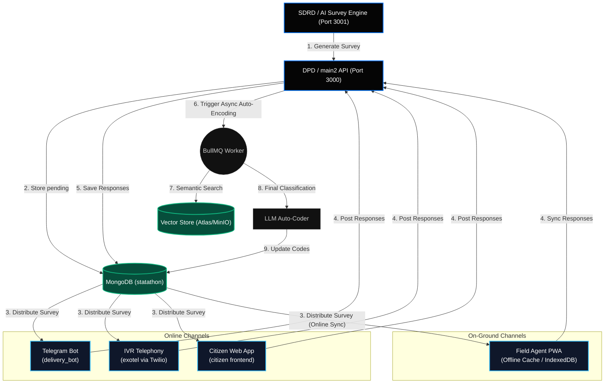

# NARAD — Master Project Context

> **This file is the single source of truth for any agent, engineer, or LLM working on the NARAD project.**
> Read this before modifying or creating any code in the workspace.

---

## 1. Problem Statement & Mission

**Organisation:** Ministry of Statistics and Programme Implementation (MoSPI), Government of India
**Competition:** Statathon (Hackathon)

MoSPI conducts hundreds of socio-economic, enterprise, and agricultural surveys across India every year through its field arm, the **National Statistical System (NSS)**. The core bottlenecks we are solving:

1. **Dynamic Survey Generation:** No unified tool exists to dynamically create, plan, and validate complex questionnaires based on active statistical indicators.
2. **Multi-modal Delivery:** Surveys must reach diverse respondents via web applications, Telegram bots, WhatsApp bots, and IVR telephone calls.
3. **Response Ingestion & Processing:** Raw responses (unstructured text, voice files, DTMF tones) must be collected, parsed, validated, and auto-coded to standard taxonomies before aggregation.
4. **Multi-lingual Support:** Survey forms must be translated and audio-rendered across 12+ regional Indian languages.

---

## 2. Platform Architecture: NSS Division Model

NARAD mirrors the **NSS Division Model** digitally, creating a clean separation of microservices:

| Division | Physical Role | NARAD Component | Technology Stack |
| :--- | :--- | :--- | :--- |
| **SDRD** <br>*(Survey Design & Research)* | Plans survey structures and questionnaire design | `backend/ai` — AI Orchestrator | Node.js, LangChain, LangGraph, MoSPI MCP, Sarvam AI, Groq |
| **DPD** <br>*(Data Processing)* | Ingests, scrutinizes, and codes response data | `backend/main2` — Core REST API | Node.js, Express, MongoDB, Mongoose, JWT |
| **FOD** <br>*(Field Operations)* | Coordinates primary data collection (multichannel) | `backend/delivery_bot`, `backend/exotel` | Telegraf (Telegram Bot), Twilio (Voice/SMS), ngrok |
| **CQCD** <br>*(Coordination, QC & Data)* | Coordination, quality control, report publication | `frontend/admin` & `frontend/citizen` | React, Vite, Geist Design System |

### High-Level Data Flow


---

## 3. Survey Lifecycle & State Machine

Surveys are locked dynamically depending on their active operational state:

```text
pending ──► approved ──► active ──► complete
  │                          │
  ├──► updating (LLM section modification)
  ├──► translating (multilingual pipeline processing)
  └──► generating_audio (Sarvam AI TTS streaming)
```

- **`pending`**: Survey generated by the multi-agent AI pipeline, awaiting admin review.
- **`approved`**: Audited by an SDRD administrator, ready to deploy.
- **`active`**: Currently listening for respondents' answers via Telegram, SMS, Voice, and Web.
- **`complete`**: Survey campaign has concluded. Responses are archived; no new answers are accepted.
- **`updating`**: Locked temporarily while the SDRD Improver Agent runs natural-language edits on a section.
- **`translating`**: Locked during background multi-language translation.
- **`generating_audio`**: Locked during Sarvam AI text-to-speech audio rendering.

> [!WARNING]
> **Active and complete surveys cannot be edited, deleted, or translated under any circumstances to prevent historical data corruption.**

---

## 4. Detailed Microservice Breakdown

### 4.1 SDRD: AI Survey Engine (`backend/ai`)
Generates dynamic, multilingual, MoSPI-grounded survey questionnaires using a sequential multi-agent team powered by **LangChain** and **LangGraph**.

* **The Agent Pipeline:**
  1. **Prompt Validator Agent (`prompt_validation_agent`):** Validates query clarity. If vague (e.g., *"Generate a survey on consumption"*), it prompts the user with clarifying questions to define scope.
  2. **Context Collector Agent (`context_collector_agent`):** Queries live datasets on the **MoSPI Model Context Protocol (MCP)** server (`list_datasets()`, `get_indicators()`, `get_data()`) to pull statistical context.
  3. **Section Planner Agent (`section_planner_agent`):** Creates the logical flow of sections (e.g., Demographics, Income, Expenses).
  4. **Question Generator Agent (`question_generator_agent`):** Populates questions section-by-section. It checks already generated questions to avoid duplicates.
  5. **Section Improver Agent (`improve_section_agent`):** Refines section questions based on natural language instructions.
  6. **Multilingual Translator Agent (`multilang_translator_agent`):** Performs section-by-section translations into 12 regional languages.
  7. **Audio Generation Agent:** Translates text to speech using the **Sarvam AI Bulbul** model, uploading `.mp3` files to MinIO.
* **Log Streaming:** Utilizes a lightweight ES6 `Map` in `surveyLogs` to record agent transitions and stream real-time logs to the UI during generation.
* **LangGraph Recursion Safety:** Standardized `recursionLimit: 100` on all agent `.invoke()` calls to prevent graph overflows.

### 4.2 DPD: Core REST API (`backend/main2`)
The REST controller managing authentication, RBAC authorization, and survey and response data ingestion.

* **Submit Survey Response (`POST /api/response/:survey_id`):**
  * Validates structure: `mcq` (must match a valid option ID), `checkbox` (must be a non-empty array of valid options), and `text` (must be a non-empty string).
  * Records paradata timestamps: `interviewStartTime` and `interviewEndTime`.
  * Triggers an asynchronous, background process (fire-and-forget IIFE) to execute:
    * `processAudioResponses()`: Performs STT transcriptions on uploaded audio files.
    * `processResponsePincode()`: Resolves local geographic parameters based on pincodes.
    * `evaluateSingleResponse()`: Flags speeder entries (e.g., duration < 1.5s).
* **Outreach Campaigns:** Supports targeted campaign creations by resolving contacts via Mock DB and tracking statuses in `CampaignTarget` (`"pending" | "sent" | "failed" | "responded"`).
* **Identity Handling:** Handoffs Aadhaar and phone inputs, converting them to a secure, anonymized `userKey` (hash) to verify target eligibility and prevent duplicates.

### 4.3 FOD: Outbound IVR Telephony Gateway (`backend/exotel`)
Dials citizens and conducts automated voice surveys using Twilio (and Exotel backup).

* **Webhook Flow Sequence:**
  1. **Initiate Call (`POST /api/survey/initiate-call`):** Triggered from the dashboard, fetches survey layout from `main2`, and registers the call details in Twilio.
  2. **Call Connection (`POST /api/survey/webhook/start`):** Triggered by Twilio when the citizen picks up. Flattens survey questions, evaluates `showIf` branching, and returns TwiML with a `<Play>` instruction (streaming question audio from the proxy) and a `<Record>` instruction.
  3. **Recording Ingestion (`POST /api/survey/webhook/answer`):** Receives the recorded audio URL from Twilio. Instantly sends a temporary `please_wait.mp3` and a `<Pause>` instruction to keep the call active. Concurrently sends the recording to the AI backend's `/speech/stt-twilio-sarvam` endpoint for transcription.
  4. **Fuzzy Option Matcher:** Maps the transcription to the lowercased labels of the options.
     * *If matched or text is valid:* Pushes answer to cache, checks `showIf` branching, and updates the live call with the next question's TwiML (or hangs up playing `thank_you.mp3` if the survey is complete).
     * *If invalid & retryCount = 0:* Increments retries, plays `invalid_response.mp3`, replays the question, and prompts another `<Record>`.
  5. **Status Webhook (`POST /api/survey/webhook/status`):** Captures premature hangups to submit whatever partial responses were collected.
  6. **Audio Proxy (`GET /api/survey/proxy-audio`):** Streams generated `.wav` files from the AI service's MinIO storage, correcting headers to `audio/x-wav` for Twilio compatibility.

### 4.4 FOD: Telegram Bot Delivery (`backend/delivery_bot`)
Provides survey questionnaire interfaces over Telegram, backing responses dynamically:

* **Session Caching:** Manages user conversation flows (`LANG` $\rightarrow$ `NAME` $\rightarrow$ `PHONE` $\rightarrow$ `OTP` $\rightarrow$ `QUESTION` $\rightarrow$ `SUBMIT`) in-memory using Telegraf.
* **Resume Verification:** Checks MongoDB for any `in_progress` survey responses matching the user's `telegramChatId` to prompt resume workflows.
* **Increment Saves:** Performs incremental updates to the database (`SurveyResponse`) after every single question is answered to prevent data loss.

### 4.5 CQCD: Quality Control & Analytics Dashboard (`frontend/admin`)
An administrative control portal utilizing the monochromatic **Vercel Geist Design System** (documented in [design.md](../frontend/design.md)).

* **CQCD Dashboard Page:** Displays all active and completed surveys for quality checks.
* **Analytics Dashboard Page:** Integrates Recharts visualizations:
  * Calculates KPIs: Total responses, average duration, and quality flags (Speeder detections).
  * Renders collection channel pie charts and geographic region bar charts.
  * Tallies option counts dynamically for MCQ/checkbox questions and plots them.

---

## 5. Adaptive Questioning & Routing

NARAD implements **Bounded AI Adaptive Questioning** to personalize surveys while maintaining strict data schemas.

### logical Expression Engine (`showIf`)
Upgrades simple equality checks to evaluate complex nested queries:
```json
"showIf": {
  "$and": [
    { "questionId": "demo_q3", "equals": "urban" },
    { "questionId": "econ_q1", "greaterThan": 15000 }
  ]
}
```
* **Section-Level Skip Rules:** Skips entire questionnaire sections if the criteria do not match (e.g. if the user is "unemployed", the "Commute Details" section is skipped).
* **Mustache-style Variable Injection:** UI text dynamically updates based on previous responses (e.g., *"Since you work as a **{{demo_occupation}}**, what is your daily commute distance?"*).

---

## 6. Hybrid NIC & NCO Auto-Coding System

NARAD automates the mapping of unstructured text responses to government classification codes: **National Industrial Classification (NIC)** and **National Classification of Occupations (NCO)**.

* **PDF Ingestion:** Extracts hierarchical taxonomy parameters from government PDFs (`pdfplumber`) and saves vector embeddings (OpenAI `text-embedding-3-small`) to MongoDB taxonomy collections.
* **Asynchronous Classifier:** Completed survey responses trigger BullMQ background worker tasks. The worker performs semantic searches in the vector store and passes the top 5 matches to the LLM to choose the best classification.
* **Confidence Threshold Routing:**
  ```text
  Total Confidence = (Vector Cosine Similarity * 0.40) + (LLM Certainty * 0.60)
  ```
  * `90 - 100` $\rightarrow$ **Auto-Approved**: Updated in the response directly.
  * `70 - 89` $\rightarrow$ **Warning Flag**: Saved to database with a warning flag.
  * `< 70` $\rightarrow$ **Human Review**: Flagged and queued in the DPD dashboard for human verification.

---

## 7. Offline CAPI PWA Synchronization

For field agents operating in remote regions, the system uses an offline-first workflow.

* **IndexedDB Caching:** The morning sync downloads active surveys and target citizen records (`MockCitizen` schema) to the local device database.
* **Fuzzy Local Search:** Search matches local NIC/NCO codes using `Fuse.js` directly on the device, allowing agents to search offline.
* **Background Sync API:** Syncs responses in the local queue to the server automatically once connection is restored.

---

## 8. Cross-Channel Paradata Analytics

The platform captures question-level micro-timings (`timeTaken` and `timestamp`) to track data collection quality.
```javascript
response: [
  {
    qid: String,
    optionId: String,
    timeTaken: Number,              // Time spent on question in seconds
    timestamp: { type: Date }       // Date response was recorded
  }
]
```
* **Speeder Detection:** Automatically flags responses where the question-level duration falls below 1.5 seconds, signaling automated submissions or invalid responses.
* **Friction Analysis:** Tracks sections with high completion times to help administrators identify confusing question layouts.

---

## 9. Environment Variables Reference

Ensure all variables are populated in your local `.env` files.

### `backend/ai` `.env`
| Variable | Purpose |
| :--- | :--- |
| `OPENAI_API_KEY` | OpenAI API Key. |
| `CHAT_MODEL` | LLM model parameter (e.g. `sarvam-30b`, `gpt-4o`). |
| `CHAT_MODEL_BASEURL` | Routing endpoint url. |
| `SARVAM_API_KEY` | Sarvam Speech API Key. |
| `GROQ_API_KEY` | Groq API Key. |
| `TWILIO_ACCOUNT_SID` | SID for Twilio call retrieval. |
| `TWILIO_AUTH_TOKEN` | Auth Token for Twilio call retrieval. |
| `MOSPI_MCP_URI` | MoSPI MCP server connection endpoint. |
| `MONGODB_URI` | MongoDB URI (e.g., `mongodb://localhost:27017`). |
| `REDIS_URL` | Redis URL (e.g., `redis://localhost:6379`). |
| `MINIO_ENDPOINT` | MinIO storage IP or hostname. |
| `MINIO_ACCESS_KEY` | MinIO Access Key. |
| `MINIO_SECRET_KEY` | MinIO Secret Key. |

### `backend/main2` `.env`
| Variable | Purpose |
| :--- | :--- |
| `MONGODB_URI` | MongoDB Connection URI. |
| `DB_NAME` | Database Name (must match `statathon`). |
| `PORT` | Local service port (set to `3000`). |
| `CORS_ORIGIN` | Allowed client host origins (e.g., `http://localhost:5173`). |
| `JWT_SECRET` | Token signing secret key. |
| `JWT_REFRESH_SECRET` | Refresh token signing secret key. |

### `backend/exotel` `.env`
| Variable | Purpose |
| :--- | :--- |
| `TWILIO_ACCOUNT_SID` | Twilio Account SID. |
| `TWILIO_AUTH_TOKEN` | Twilio Auth Token. |
| `TWILIO_PHONE_NUMBER` | Telephony Sender Caller ID. |
| `NGROK_URL` | ngrok public tunnel endpoint (e.g. `https://xxxx.ngrok-free.app`). |
| `MAIN2_API_URL` | Backend Endpoint (set to `http://localhost:3000`). |
| `AI_API_URL` | AI Engine Endpoint (set to `http://localhost:3001`). |

---

## 10. Database Configurations & Shared Schemas

Both the `backend/ai` and `backend/main2` microservices connect to the **same** database (`statathon`) and share the same canonical schema.

### Survey Schema (`Survey` Collection)
```javascript
{
  surveyId: { type: String, unique: true },
  name: { type: String, required: true },
  status: { 
    type: String, 
    enum: ["pending", "approved", "active", "complete", "updating", "translating", "generating_audio"], 
    default: "pending" 
  },
  accessType: { type: String, enum: ["general", "targeted"], default: "general" },
  supportedLanguages: [{ type: String }],
  questionSections: [{
    sectionName: { type: String, required: true },
    questions: [{
      qid: { type: String, required: true },
      type: { type: String, enum: ["mcq", "text", "checkbox"], required: true },
      text: { type: Map, of: String },        // { english: "...", hindi: "..." }
      audio: { type: Map, of: String },       // { english: "URL" }
      options: [{
        id: { type: String },
        label: { type: Map, of: String }
      }],
      prefill: { type: String },
      showIf: {
        questionId: { type: String },
        equals: { type: String }
      }
    }]
  }],
  allowedChannels: [{ type: String, enum: ["web", "ivr", "whatsapp"] }],
  categories: [{ type: String }],
  createdBy: { type: String, required: true }
}
```

---

## 11. Deployment Architecture

### Local Development Proxy
```text
Nginx Reverse Proxy (Port 8080)
  ├── /api               → main2:3000
  ├── /speech            → ai:3001
  ├── /delivery          → exotel:3002
  └── /bot               → delivery_bot:5000
```

### Production Infrastructure Target
```text
                     ┌─────────────────────────────────────────┐
                     │           PUBLIC SUBNET                  │
   Citizens/Admins   │  Edge Load Balancer → API Gateway       │
   ─────────────────►│                                         │
                     └──────────────┬──────────────────────────┘
                                    │
                     ┌──────────────▼──────────────────────────┐
                     │           PRIVATE SUBNET                 │
                     │  Reverse Proxy / Nginx Gateway          │
                     │    ├── Main Ingestion (main2)           │
                     │    │                                    │
                     │    ├── Delivery Gateway (exotel)        │
                     │    │                                    │
                     │    ├── LLM Inference (vLLM / Ollama)    │
                     │    │                                    │
                     │    └── Shared MongoDB & Redis Cluster   │
                     └─────────────────────────────────────────┘
```
* **LLM Scalability:** Utilizes **Ollama** for lightweight offline development testing, scaling to **vLLM** hosted on **A100-80GB Spot GPU instances** in production to support batch inference.
