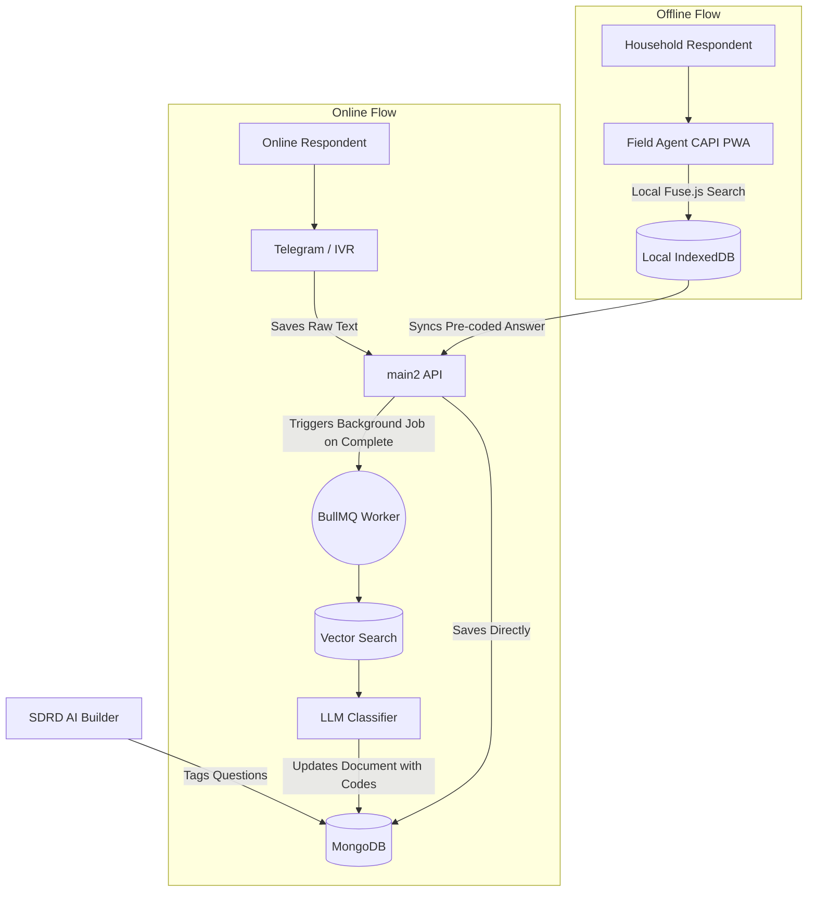

# NARAD — NIC & NCO Auto-Encoding Integration Master Plan

> [!IMPORTANT]
> This document proposes the end-to-end integration of National Industrial Classification (NIC) and National Classification of Occupations (NCO) auto-coding into the NARAD ecosystem. It addresses both online multichannel delivery (DPD) and offline CAPI delivery (FOD).

---

## 1. Significance of NIC and NCO Codes

The **National Industrial Classification (NIC)** and **National Classification of Occupations (NCO)** are standardized taxonomies used by the Ministry of Statistics and Programme Implementation (MoSPI) to classify economic activities and occupational roles.

* **NIC (Industry):** Classifies what a business or enterprise *does* (e.g., "Manufacture of dairy products").
* **NCO (Occupation):** Classifies what an individual *does* within a business (e.g., "Software Developer", "Dairy worker").

**Why Auto-Encode?**
Historically, field agents collected raw text descriptions of jobs and industries. These were later manually read and mapped to 5-digit NIC/NCO codes by human coders at DPD (Data Processing Division) — a massively time-consuming, error-prone bottleneck. By automating this mapping at the point of data collection or ingestion, MoSPI can publish statistical reports months faster.

---

## 2. The Architectural Challenge

Integrating this into the current NARAD architecture presents a multi-faceted challenge:

1. **SDRD (AI Survey Builder):** The AI currently generates dynamic questions but doesn't inherently "know" which questions map to NIC or NCO, meaning it doesn't instruct the collection channels on how to handle the data.
2. **Online Delivery (Telegram / IVR / Web):** Respondents often reply with unstructured text or voice (e.g., "I work in an IT company fixing computers"). This must be converted to an NCO/NIC code without human intervention.
3. **Offline CAPI (Field Agents):** Agents operate without internet. They cannot rely on a cloud AI backend to interpret text on the fly. They need an offline-first mechanism.
4. **DPD (main2 Backend):** Needs a standardized way to ingest, verify, and store these codes regardless of whether they came from an online bot or an offline agent.

---

## 3. Proposed Hybrid Architecture (Asynchronous Post-Processing)

To solve these challenges robustly while maintaining ultra-low latency for citizens, we propose a **Hybrid Auto-Encoding Architecture with Asynchronous Post-Processing**:

### A. The Taxonomy Database (Ground Truth)
First, we must convert the `NIC_Sector.pdf` and `NCO-codes5.pdf` files into structured data. We will store these in two new MongoDB collections: `NIC_Taxonomy` and `NCO_Taxonomy`. 

**Technical Flow for PDF Ingestion:**
1. **Extraction (OCR/Parsing):** Use a robust document parser like `pdfplumber` (Python) or `LlamaParse` to extract the tabular hierarchical data (Sections -> Divisions -> Groups -> Classes -> Sub-classes) from the PDFs.
2. **Structuring & Flattening:** Convert the nested taxonomy into a flat JSON array where each object has the full lineage (e.g., `{ "code": "10501", "description": "Manufacture of pasteurised milk...", "parent": "1050" }`).
3. **Embedding Generation:** For each record, construct a rich string combining the code's description and its parents' descriptions. Send this string to an embedding API (e.g., OpenAI `text-embedding-3-small`) to generate a vector array.
4. **Database Insertion:** Save the objects and their generated vector embeddings to the MongoDB Taxonomy collections. We will create an Atlas Vector Search Index on the `embedding` field to allow for instant fuzzy/semantic searching.

### B. SDRD AI Phase: Question Tagging
When the AI generates a survey, the prompt must be updated to instruct the AI to append a metadata tag (`autoCodeType: "NIC" | "NCO" | null`) to any question asking for occupation or industry.

### C. The Collection Phase (Two Paths)

**Path 1: Online Channels (Telegram, IVR) -> Asynchronous Post-Processing**
Instead of blocking the user and forcing them to wait for the LLM to classify their answer mid-survey, we collect the raw text instantly and process it *after* the survey is completed.
1. The response is collected as text and saved to `main2` instantly (Zero latency).
2. Once the respondent finishes the survey (SurveyResponse `status` becomes `completed`), an event is fired to a background worker queue (e.g., Redis BullMQ).
3. The background worker finds all answers for questions tagged with `autoCodeType`.
4. It runs a **Semantic Vector Search** against the Taxonomy DB using the respondent's text, retrieving the top 5 closest codes.
5. An LLM makes the final selection from the top 5, calculates a confidence score, and silently updates the `SurveyResponse` document in the background.

**Path 2: Offline CAPI (FOD Agents) -> Edge Resolution**
For field agents in areas with no internet:
1. The web-app (PWA) downloads a lightweight, compressed JSON mapping of the NIC/NCO taxonomy via IndexedDB during the morning sync.
2. When the agent reaches an occupation question, the UI presents a cascading dropdown or a fuzzy-search auto-complete powered by local JavaScript (e.g., `Fuse.js`).
3. The agent selects the exact code *with* the respondent.
4. The response is stored locally and later synced to `main2` with the code already attached.

---

## 4. System Flowcharts

### High-Level Data Flow Diagram


---

## 5. Confidence Score Calculation

The confidence score (0 to 100) dictates whether the system trusts the AI classification or flags it for human DPD review.

**How it is calculated:**
1. **Vector Cosine Similarity (Weight: 40%):** When we query the Vector DB with the raw text, we get a similarity score between 0.0 and 1.0. A score of 0.85 (85%) means the text is semantically very close to the taxonomy description.
2. **LLM Logprobs / Certainty (Weight: 60%):** When the LLM chooses the best code from the top 5 vector matches, we instruct it to output its reasoning and a self-assessed certainty score (or use logprobs if available).
3. **The Formula:** `Total Confidence = (Cosine_Similarity * 40) + (LLM_Certainty * 60)`
4. **Thresholds:** 
   - `90 - 100`: Auto-approved.
   - `70 - 89`: Accepted, but marked with a "Warning" flag.
   - `< 70`: Flagged for "Human Review". The DPD dashboard will highlight these rows so a human admin can manually select the correct code from a dropdown.

---

## 6. Schema Changes Required

### A. Survey Schema (`surveySchema.js`)
We need to tell downstream consumers which questions require auto-coding.

```javascript
autoCodeType: {
    type: String,
    enum: ["NIC", "NCO", null],
    default: null,
    required: false
}
```

### B. Response Schema (`responsesSchema.js`)
```javascript
const ResponseSchema = new mongoose.Schema({
    qid: { type: String, required: true },
    answer: { type: mongoose.Schema.Types.Mixed },
    
    // NEW: Auto-encoding fields
    encodedData: {
        codeType: { type: String, enum: ["NIC", "NCO"] },
        codeValue: { type: String }, 
        confidence: { type: Number, min: 0, max: 100 },
        reviewStatus: { type: String, enum: ["auto_approved", "needs_review", "human_approved"] },
        source: { type: String, enum: ["ai_classifier", "manual_agent"] }
    }
}, { _id: false });
```

---

## 7. Pros, Cons & Practicality Analysis

### ✅ Pros
* **Zero Latency for Citizens:** By moving the AI classification to an asynchronous background job after the survey is completed, the citizen experiences zero delay during the chat or IVR call.
* **Massive Time Savings:** DPD currently spends months manually coding free-text responses.
* **Fallback Safety Net:** The Confidence Score ensures that ambiguous responses ("I make things") are caught and flagged for human review instead of silently corrupting data.

### ❌ Cons & Challenges
* **PDF Parsing Complexity:** Extracting hierarchical data cleanly from MoSPI's tabular PDFs is notoriously difficult.
* **Infrastructure Overhead:** Requires adding a background job queue (Redis + BullMQ) to the architecture to handle the asynchronous processing reliably.

### 🔄 Comparison to Alternatives
| Approach | Accuracy | Latency | Scalability |
|---|---|---|---|
| In-Stream AI Processing | Very High | **Very Slow** (Blocks Chat) | Low |
| **Async Background AI Processing** | **Very High** | **Zero Latency** | **High** (Queued) |
| Pure Keyword/Regex mapping | Very Low (Fails on synonyms) | Zero Latency | High |
